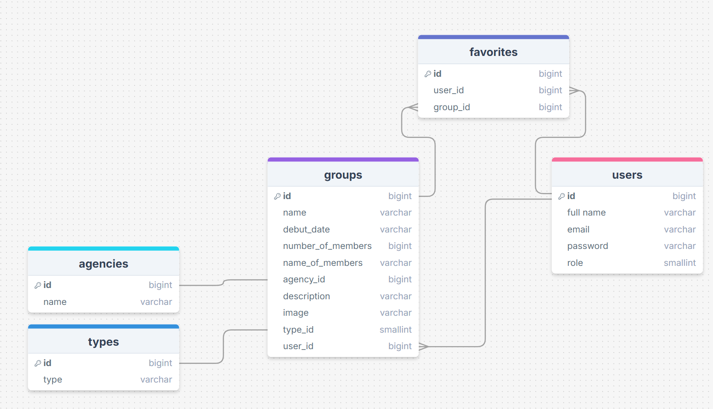

# Changelog

## 28/10/25

Vandaag heb ik de profiel pagina toegevoegd. Hier stond al de optie van het wijzigen van informatie op. Ik heb
toegevoegd dat je daar de groepen kan zien die je als gebruiker zelf hebt aangemaakt.  
Daarnaast heb ik ervoor gezorgd dat als je een groep gaat bewerken dat je niet elke keer weer opnieuw een foto moet
toevoegen. Nu veranderd die de foto in de database als je een nieuwe toevoegd en als je niks veranderd bewaart die
gewoon de foto die je al had toegevoegd.

## 27/10/25

Vandaag heb ik ervoor gezorgd dat wanneer de admin een groep niet meer op actief zet dat je er ook hardcoded niet bij
kan. Alleen de admin kan altijd wijzigen en verwijderen maar de gebruikers kunnen nu wanneer hun groep niet op actief
staat deze niet meer wijzigen of verwijderen.  
Ook heb ik nog aan registerdUserController en User.php de role toegevoegd zodat dit goed meegenomen wordt bij controle
en het inloggen. 
Daarnaast heb ik ervoor gezorgd dat mijn welcome page af is.

## 24/10/25

Vandaag ben ik met het admin dashboard aan de slag gegaan. De admin kan nu ervoor kiezen om groepen wel of niet op de
site te laten zien. Ook kan die elke groep editen en verwijderen waar nodig. Alleen de admin kan op de pagina's van het
dashboard komen. Ook heb ik deze pagina een layout gegeven.

## 23/10/25

Vandaag ben ik bezig geweest met de eerste layout van de site. Ik heb de layout gezet voor de navigatie balk, de
overzicht pagina van de groepen en de homepage. 
Ook heb ik ervoor gezorgd dat wanneer de admin inlogd deze terecht komt op de dashboard pagina. Wanneer een gebruiker
inlogd komt deze op de welkom/home pagina. De user kan niet meer op de dashboard pagina komen.  
Daarna heb ik een layout gegeven aan mijn show(detail), edit en create pagina.

## 22/10/25

Ik heb alle pagina's afgestemd op wat wel en niet zichtbaar moet zijn als je gast bent of ingelogd bent. Daarnaast heb
ik de user_id toegvoegd aan de groups table. Nu wordt elke nieuwe toegevoegde groep gekoppeld aan de gebruiker die het
aanmaakt. Gebruikers kunnen hierdoor alleen hun eigen gemaakte groepen wijzigen en verwijderen.

## 21/10/25

Ik heb de navigatie balk zo aangepast dat je login en register alleen ziet als je niet ingelogd bent en dat je
favorieten en log out ziet als je wel ingelogd bent.  
Ook heb ik ervoor gezorgd dat wanneer je een groep toevoegd en een veld vergeet in te vullen al op sumbit drukt dat all
je velden ingevuld blijven.  
Daarnaast heb ik 'role' toegevoegd aan de user tabel. Elk aangemaakte account krijgt nu een rol aangewezen: admin of
user. Nu ben je standaard een user.

## 20/10/25

Ik heb een werkende zoekfunctie waar je de groepen op naam kan zoeken.  
Je ziet eerst alle groepen die er zijn. Zodra je een zoekterm hebt ingevuld krijg je alleen het antwoord te zien. Ook
heb ik een group count toegevoegd dat aangeeft hoeveel groepen gevonden zijn. 
Daarnaast heb ik ervoor gezorgd dat je je zoekopdracht kan filteren op agency en type. Hierdoor wordt het zoekproces nog
accurater.  
Ten slotte heb ik vandaag de functie toegevoegd dat je foto's kan toevoegen aan de groep. Deze kan je bij het aanmaken
toevoegen en veranderen bij het wijzigen van de groep.

## 18/10/25

Ik heb agency toegevoegd aan mijn create en edit pagina waardoor de gebruiker nu de belangrijkste info kan toevoegen en
bewerken van de groepen.  
Daarnaast ben ik gaan kijken hoe ik in een zoekbalk kan zoeken op namen van de groepen.

## 17/10/25

Vandaag heb ik de edit gemaakt waardoor je de informatie van groups kan aanpassen en je wijzigingen kan opslaan.  
Daarnaast heb ik de knop toegevoegd waarmee je groepen kan verwijderen.  
Ook heb ik de tabel voor agencies aan gemaakt en deze verbonden met de groups tabel.

## 15/10/25

Vandaag heb ik de create gemaakt om groups toe te voegen en daarbij een form.  
Ook heb ik een nieuwe tabel: types, toegevoegd en deze met relaties aan de groups gekoppeld.  
Je kunt nu dus nieuwe groepen toevoegen aan de database en daarbij het bijbehorende type kiezen.

## 14/10/25

Vandaag heb ik een migration toegevoegd. De bijbehorende tabel is groups. Hier heb ik dummy data aan toegevoegd.
Ook heb ik een model toegevoegd: group, en deze getoond in de view. 
Daarnaast heb ik een navigatie balk toegevoegd en heb ik een nieuwe verbeterde versie van mijn ERD toegevoegd.

## 13/10/25

Vandaag heb ik ervoor gezorgd dat er verschil is tussen wat een ingelogde en uitgelogde gebruiker ziet op de status
pagina.

## User Stories

### Gebruiker  

Must have:
  1. Als gebruiker wil ik een overzicht van K-pop groepen hebben zodat ik nieuwe groepen kan ontdekken.
  2. Als gebruiker wil ik de details van groepen zien zodat ik meer te weten kan komen over de verschillende groepen.

Should have:
  3. Als gebruiker wil ik groepen kunnen toevoegen aan mijn favorieten zodat ik snel deze groepen weer terug kan
vinden.
  4. Als gebruiker wil ik filters gebruiken tijdens het zoeken zodat ik sneller groepen kan vinden.

Could have:
  5. Als gebruiker wil ik K-pop groepen kunnen toevoegen en bewerken zodat de site het meest accuraat is.
  6. Als gebruiker wil ik mijn profiel kunnen bewerken zodat ik mijn account kan personaliseren.

### Admin  

Must have:
  1. Als admin wil ik nieuwe K-pop groepen kunnen toevoegen aan de database zodat de site up-to-date blijft.
  2. Als admin wil ik gebruikers kunnen beheren zodat ik mijn website netjes en beschaafd kan houden.
  3. Als admin wil ik groepen kunnen bewerken of verwijderen zodat de site helemaal bij blijft.

Should have:
  4. Als admin wil ik de acties van gebruikers beheren zodat er geen rare dingen op de site komen te staan.

## ERD

