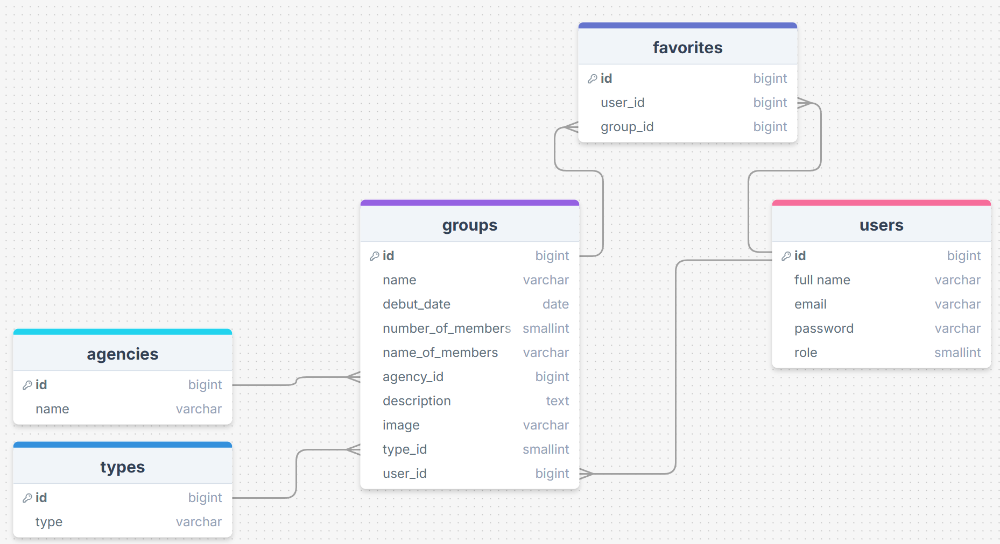

# Changelog

## 17/10/25

Vandaag heb ik de edit gemaakt waardoor je de informatie van groups kan aanpassen en je wijzigingen kan opslaan.  
Daarnaast heb ik de knop toegevoegd waarmee je groepen kan verwijderen.  
Ook heb ik de tabel voor agencies aan gemaakt en deze verbonden met de groups tabel.

## 15/10/25

Vandaag heb ik de create gemaakt om groups toe te voegen en daarbij een form.  
Ook heb ik een nieuwe tabel: types, toegevoegd en deze met relaties aan de groups gekoppeld.  
Je kunt nu dus nieuwe groepen toevoegen aan de database en daarbij het bijbehorende type kiezen.

## 14/10/25

Vandaag heb ik een migration toegevoegd. De bijbehorende tabel is groups. Hier heb ik dummy data aan toegevoegd.
Ook heb ik een model toegevoegd: group, en deze getoond in de view. 
Daarnaast heb ik een navigatie balk toegevoegd en heb ik een nieuwe verbeterde versie van mijn ERD toegevoegd.

## 13/10/25

Vandaag heb ik ervoor gezorgd dat er verschil is tussen wat een ingelogde en uitgelogde gebruiker ziet op de status
pagina.

## User Stories

### Gebruiker  

Must have:
  1. Als gebruiker wil ik een overzicht van K-pop groepen hebben zodat ik nieuwe groepen kan ontdekken.
  2. Als gebruiker wil ik de details van groepen zien zodat ik meer te weten kan komen over de verschillende groepen.

Should have:
  3. Als gebruiker wil ik groepen kunnen toevoegen aan mijn favorieten zodat ik snel deze groepen weer terug kan
vinden.
  4. Als gebruiker wil ik filters gebruiken tijdens het zoeken zodat ik sneller groepen kan vinden.

Could have:
  5. Als gebruiker wil ik K-pop groepen kunnen toevoegen en bewerken zodat de site het meest accuraat is.
  6. Als gebruiker wil ik mijn profiel kunnen bewerken zodat ik mijn account kan personaliseren.

### Admin  

Must have:
  1. Als admin wil ik nieuwe K-pop groepen kunnen toevoegen aan de database zodat de site up-to-date blijft.
  2. Als admin wil ik gebruikers kunnen beheren zodat ik mijn website netjes en beschaafd kan houden.
  3. Als admin wil ik groepen kunnen bewerken of verwijderen zodat de site helemaal bij blijft.

Should have:
  4. Als admin wil ik de acties van gebruikers beheren zodat er geen rare dingen op de site komen te staan.

## ERD

